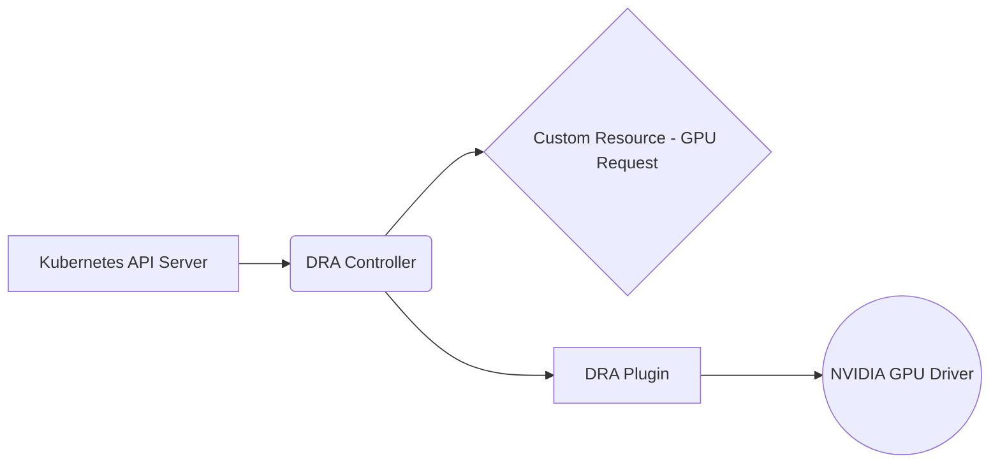

# System Patterns

## System Architecture
The k8s-dra-driver project follows a typical Kubernetes controller pattern. It consists of a controller component that watches for changes to custom resources (e.g., GPU requests) and a plugin component that interacts with the NVIDIA GPU driver to allocate and manage GPU resources.

## Key Technical Decisions
*   Using the Kubernetes Device Resource API (DRA) for GPU resource management.
*   Implementing a custom resource definition (CRD) for GPU requests.
*   Leveraging the NVIDIA GPU driver for low-level GPU operations.

## Design Patterns in Use
*   Controller pattern
*   Observer pattern

## Component Relationships
